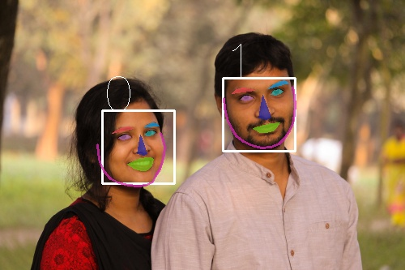
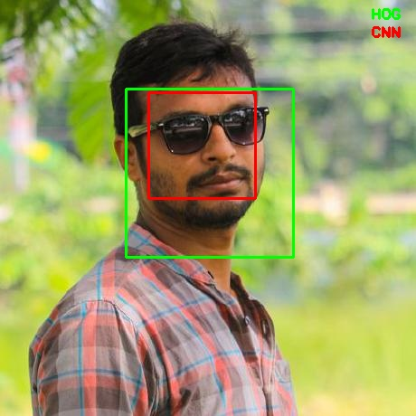
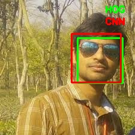
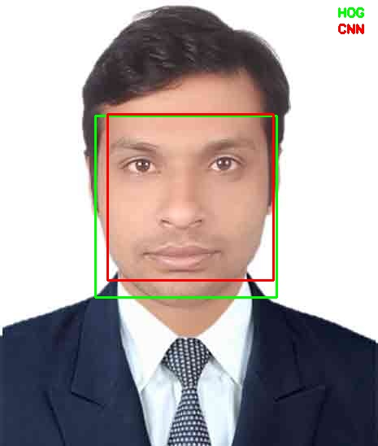

## face_extraction
Face region extract from image or vedio using opencv python and haarcascade.it can able to extract multiple face from image.

New Test Result:

Code not push yet here !

## Test Result
Test 1:

Test 2:

Test 3:

